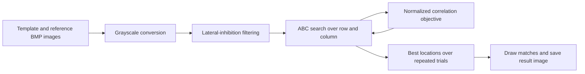

# Image Retrieval via Lateral Inhibition and Artificial Bee Colony Search

**Enhance the features, then search for the template.** This MATLAB repository accompanies Bai Li's **“An evolutionary approach for image retrieval based on lateral inhibition,”** published in *Optik* in 2016. It combines a lateral-inhibition preprocessing model with artificial bee colony (ABC) optimization to locate a template inside a reference image.

The demo treats matching as a two-dimensional optimization problem: the variables select an image-window location, and the objective evaluates its similarity to the template. It is a classical template-matching experiment, with no neural-network training or pretrained model download.

## Pipeline



`LI.p` constructs the lateral-inhibition weights and `LItrans.p` transforms the images. `run_ABC.m` searches candidate locations using employed-bee, onlooker and scout/reinitialization steps. `obj.m` computes the normalized dot product of the transformed template and candidate window; it does **not** subtract their means. `calculateFitness.m` converts the objective to the fitness representation used by the search.

## Quick start

Requirements: **MATLAB** with **Image Processing Toolbox** for the image-processing/display workflow, and compatibility with the supplied `.p` files. No external numerical solver or optimization toolbox is called by the exposed ABC implementation.

```matlab
cd('C:/path/to/Image-Retrieval-via-Lateral-Inhibition');
rng(0);                 % Optional control of the random-number sequence
run_me;
```

The entry point is **`run_me.m`**. Keep the working folder at the repository root so the image filenames resolve. The default pair is `template1.bmp` and `test1.bmp`.

The script displays the original grayscale reference, the lateral-inhibition result and the matched locations. It writes **`IR_result.bmp`** and the search writes **`ABC_backup.mat`** in the current folder. Subsequent runs overwrite these outputs. Because termination uses elapsed time, a fixed random seed alone does not guarantee identical results on different machines.

## Parameters and returned values

| Setting | Default | Meaning |
| --- | --- | --- |
| `N` | 3 | Number of rings in the lateral-inhibition weight matrix. |
| `NP` | 40 | ABC population setting; the code uses `NP / 2` food sources. |
| `runtime` | 10 | Independent search trials. |
| `maxTime` | 5 s | Elapsed-time limit checked at the end of each search iteration. |
| `maxCycle` | 9999 | Additional internal iteration cap. |

`[CB, abc] = run_ABC(NP, runtime, maxTime)` returns the best location from each trial in `CB` and the best-objective history in `abc`. The history is preallocated to `maxCycle`; entries beyond each trial's actual termination remain unused. The two coordinates are used as **row and column offsets** by `obj.m`, despite the local names `x` and `y`.

The ten default trials are a demonstration configuration. Use an appropriate repeated-run experimental protocol when comparing stochastic optimizers; the original entry comments recommend at least 30 trials for statistical comparisons.

## File and function guide

| File | Role |
| --- | --- |
| `run_me.m` | Load images, preprocess, run repeated optimization and display/save matches. |
| `LI.p` | Protected lateral-inhibition weight construction. |
| `LItrans.p` | Protected image transformation using those weights. |
| `run_ABC.m` | Inspectable ABC population initialization, candidate updates, selection, reinitialization and stopping logic. |
| `obj.m` | Normalized correlation similarity for a candidate window location. |
| `calculateFitness.m` | Objective-to-fitness transformation. |
| `plot_result.p` | Protected match-overlay visualization; its source is not included. |
| `template1/3/5/6.bmp`, `test1/3/5/6.bmp` | Four supplied template/reference pairs. |
| `IR_result.bmp` | Example/generated matching-result image; overwritten by the demo. |
| `ZXX.pdf` | Main 2016 image-retrieval paper. |
| `BE-ABC_optik.pdf` | Related paper on balance-evolution ABC and lateral inhibition. |

To try another pair, change both input filenames in `run_me.m` and the later `imread('test1.bmp')` used for the original-image display. Use a template smaller than its reference image. For a new objective, edit `obj.m` and preserve the search's maximize-similarity/minimize-fitness convention.

The included BE-ABC paper is related reading. The entry script calls **`run_ABC`**; the presence of that PDF should not be taken to mean the demo automatically executes every BE-ABC mechanism or reproduces all comparisons in the later paper.

## Required citations

The original source requests citation of both the retrieval paper and the lateral-inhibition model paper:

> **1.** Bai Li, “An evolutionary approach for image retrieval based on lateral inhibition,” *Optik*, **127**(13), 5430–5438, 2016. [DOI](https://doi.org/10.1016/j.ijleo.2016.02.056).

```bibtex
@article{Li2016LateralInhibitionRetrieval,
  author = {Li, Bai},
  title = {An evolutionary approach for image retrieval based on lateral inhibition},
  journal = {Optik},
  volume = {127}, number = {13}, pages = {5430--5438}, year = {2016},
  doi = {10.1016/j.ijleo.2016.02.056}
}
```

> **2.** Bai Li, Ya Li, Hongxin Cao, and Hamid Salimi, “Image enhancement via lateral inhibition: An analysis under illumination changes,” *Optik*, **127**(12), 5078–5083, 2016. [DOI](https://doi.org/10.1016/j.ijleo.2016.02.054).

```bibtex
@article{Li2016LateralInhibitionEnhancement,
  author = {Li, Bai and Li, Ya and Cao, Hongxin and Salimi, Hamid},
  title = {Image enhancement via lateral inhibition:
           An analysis under illumination changes},
  journal = {Optik},
  volume = {127}, number = {12}, pages = {5078--5083}, year = {2016},
  doi = {10.1016/j.ijleo.2016.02.054}
}
```

Related reading: Bai Li, Changjun Zhou, Hong Liu, Ya Li, and Hongxin Cao, “Image retrieval via balance-evolution artificial bee colony algorithm and lateral inhibition,” *Optik*, **127**, 11775–11785, 2016. [DOI](https://doi.org/10.1016/j.ijleo.2016.09.085).

## License

See [GNU GPL v3](LICENSE) and the notices in the files. The research papers retain their publishers' copyright notices.
